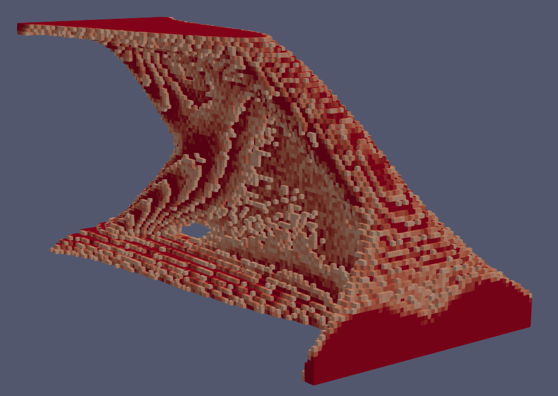

=====================================
HypOptLib documentation
=====================================

HypOptLib is a Petsc based semi-parallel implementation of hyperoptimization with a Python wrapper. The package is a
fork of the topology optimization framework
`TopOpt <https://www.topopt.mek.dtu.dk/apps-and-software/large-scale-topology-optimization-code-using-petsc>`_ by Aage
et. al., along with some borrowed elements from the derivative `TopOptLib <https://doi.org/10.1007/s00158-021-03018-7>`_ by Smit et. al.

Credit
===========================
| **Hyperoptimization Algorithm** Hazhir Aliahmadi
| **Code** Aidan Sheedy
| **Advisor** Greg van Anders

Borrowed Material
===========================
| **TopOpt** `Niels Aage, Erik Andreassen, Boyan Stefanov Lazarov <https://www.topopt.mek.dtu.dk/apps-and-software/large-scale-topology-optimization-code-using-petsc>`_
| **TopOptLib** `Thijs Smit, Niels Aage, Stephen J. Ferguson, Benedikt Halgason <https://doi.org/10.1007/s00158-021-03018-7>`_

.. note::
   This documentation will *not* cover the physics, derivation, or overview of the hyperoptimization algorithm.

Is HypOptLib right for you?
===========================
HypOptLib is intended to demonstrate the possibilities of hyperoptimization, to show off what it can do. As such, it was primarily
intended to showcase hyperoptimization on large topology optimization problems. This is why it was built off
`TopOpt <https://www.topopt.mek.dtu.dk/apps-and-software/large-scale-topology-optimization-code-using-petsc>`_, which is arguably the
highest performing large-scale topology optimization solver to date. As such, there are use cases HypOptLib is good for, and those it
is probably not best suited to.

What is HypOptLib for?
---------------------------
As it was built off the TopOpt Petsc code, there are two main use cases that HypOptLib excels at. The first is any derivative topology optimization code
from topopt; ie anything TopOpt can do, HypOptLib can apply hyperoptimization to it. Most problems can be adapted in Python, and some more advanced cases might
need a little more work in the C++ code. But in general, with few modification HypOptLib will be compatible with any artbitrary topology optimization problem that
is supported by TopOpt.

The second use case that HypOptLib is suitable for is optimization problems that use Petsc in general. The Hyperoptimization class was abstracted from the
original TopOpt code, with wrappers provided for filtering, Lagrange Multipliers, and sensitivities. As such, problems that require the high-performance, scalable
solvers that Petsc provides for their sensitivity calculations can simply implement derived classes for each wrapper and use rest of HypOptLib unchanged.

What is it not for?
---------------------------
Any optimization problem that does not fall into the above two categories is probably not suited to HypOptLib. The nature of the library is that it is focused on
large, parallelized workloads written explicitly for Petsc. While the classes are abstracted, the underlying data structures are all Petsc data structures. The
hyperoptimization algorithm is, however, very lightweight. This means that generalized hyperoptimization codes in Python, C++, or really any language would serve
much better for a large portion of optimization problems that can benefit from hyperoptimization.

.. toctree::
   :caption: Getting Started
   :maxdepth: 2

   background
   installation
   library
   additions
   fullapi

Indices and tables
==================

* :ref:`genindex`
* :ref:`search`
