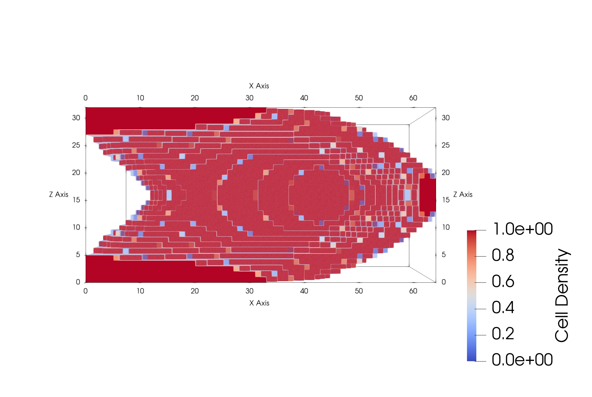
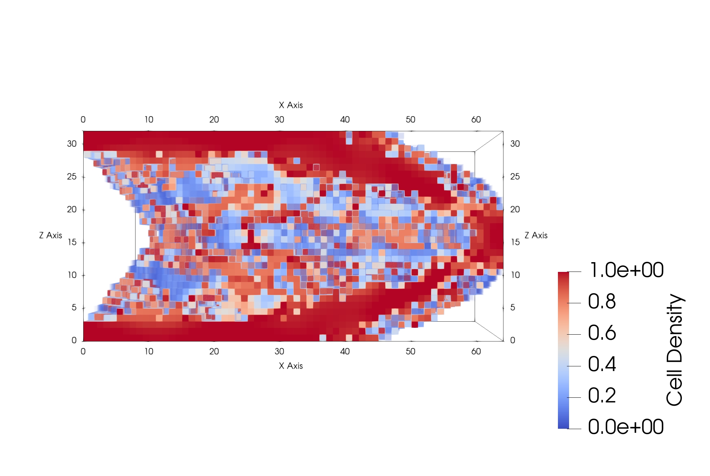

# Summary

Topology optimization is a powerful,[@gigavoxel] well-established [@TopOptBook]
numerical technique for a range of scientific and engineering problems that
require the generation of optimal material distribution to satisfy a set of
physical objectives. The utility of topology optimization in applications to
additive manufacturing [@TopOptAddMfg] or morphogenesis [@which] requires
systematically understanding how deviations from optimality affect key design
objectives [@hypopt]. `HypOptLib` provides a C++/Python implementation of
hyperoptimization,[@hypopt] an information theory based framework
[@ParetoLaplace] for systematically analyzing non-optimal matter distributions.
`HypOptLib` can generate high-resolution "importance maps" of deposition
patterns in topology optimization problems. We give example results for
compliance minimization problems,[@which] via `PetSc` [@petsc-web-page], but the code can
be adapted straightforwardly to problems that rely on different underlying
physics.

# Statement of need

Numerical methods for design problems that involve spatially depositing material
to satisfy some structural,[@which] optical,[@which], hydrodynamic,[@which] or
thermodynamic[@which] criterion are crucial both for engineering design
[@which] and for understanding morphogenesis.[@which] A key challenge in the
practical implementation of these methods, e.g., via techniques such as topology
optimization [@TopOptBook], is to ensure that generated patterns of spatial deposition
can be produced reliably and robustly. However, ensuring reliable, robust
realizations requires the ability to understand redundancy among deposition
patterns.[@hypopt] Recent work has introduced "hyperoptimization" [@hypopt] as an
information-theoretic approach to robust implementations of topology
optimization. Hyperoptimization has been shown to generate so-called importance
maps that indicate the relative (importance) of spatial elements to overall
design performance. Capitalizing on the power of that proof-of-principle
demonstration requires numerical simulation codes that are capable of
implementing the approach at scale.

While there are extensive software packages for topology optimization,
leveraging PETSc,[@Topopt] [@TopOptLib] using GPUs, [@Schmidt] and more [@which],
there are none available which can effectively analyze deviations from
optimality. A scalable implementation of hyperoptimziation enables a richer
understanding of topology optimization problems and solutions than the current offerings
by quantifying the robustness of non-optimal solutions.

# Functionality and Overview

`HypOptLib` is a Python/C++ implementation of hyperoptimization [@hypopt] that
adapts Nose-Hoover chain thermostats [@NHC] from particle-based, molecular
dynamics algorithms [@frenkelsmit] to continuum problems in topology
optimization.[@which] The present implementation relies on the relationship
between information theory and statistical mechanics [@jaynes1] to cast
recently introduced Pareto-Laplace filters [@ParetoLaplace] on the solution
space of the optimization problem as mathematically equivalent to a
thermodynamic ensemble of putative solutions. `HypOptLib` leverages `PetSc`
[@petsc-web-page] as a back-end to allow execution for high-resolution topology
optimization problems. The hyperoptimization framework is physics-agnostic and
can be applied to a broad range of problem domains. `HypOptLib` gives example
applications to problems related to mechanical stiffness, e.g. compliance
minimization [@which], but the code is extensible to problems that rely on
different forms of underlying physics.

The code is built around the `TopOpt_in_PETSc` package, which implements a scalable,
parallel code for topology optimization.[@TopOpt] By replacing the optimization
class with the hyperoptimization algorithm, `HypOptLib` leverages the proven
finite element analysis code from `TopOpt_in_PETSc`. In addition, the algorithm is
abstracted away from the filtering, sensitivity, and Lagrange multiplier code to allow
for portability to any arbitrary optimziation problem that can leverage PETSc. Finally,
a Python wrapper is provided for easy and quick problem definition and use.

While hyperoptimization itself has not been parallelized, `HypOptLib` has been
implemented in a "semi-parallel" manner which allows for the parallel computation of
all abstracted code, namely the sensitivity calculations. For topology optimization this
usually involves finite element analysis which greatly benefits from parallel computing.

## Sample Results

`HypOptLib` is used to generate optimized solutions to topology optimization problems with
user defined paremeters. The primary parameters used are:

 * Boundary conditions to define the geometry and loads

 * Temperature of the system, which will affect "optimality"

 * Simluation settings, such as timestep, numer of iterations, volume fraction etc.

The full list of parameters can be found in the [online documentation](). Once the problem
geometery has been defined, the primary parameter that is varied across simulations is the
temperature. This allows for investigation of solutions at decreasing optimality. Samples
of results at temperatures 0 and 1.75E-06 are provided in \autoref{fig:zeroTempEx} and
\autoref{fig:lowTempEx} respectively. The key insights from solutions like this come from
averaging simulations over time across a range of temperatures. The averages show how cells
behave at lower and lower optimality, and can be used to generate importance maps when combined
with optimal solutions at temperature 0.

# Acknowledgements

We acknowledge discussions with Ruben Perez. We acknowledge the support of the
Natural Sciences and Engineering Research Council of Canada (NSERC) grants
RGPIN-2019-05655 and DGECR-2019-00469.

# References
